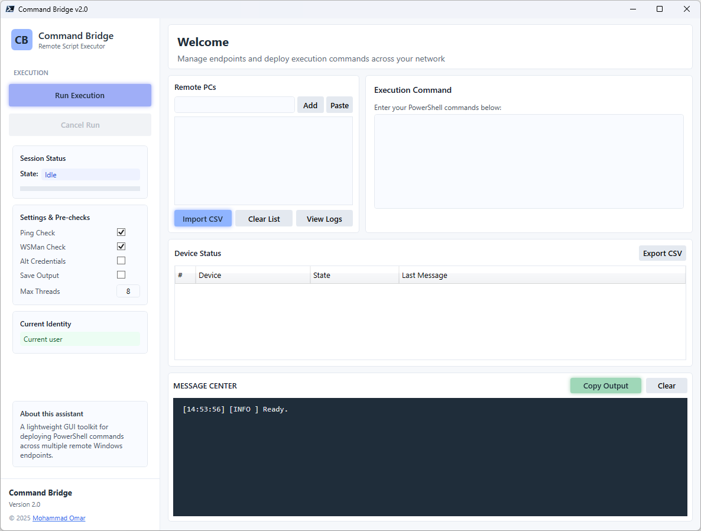

<div align="center">

# 🔌 CommandBridge

**Remote Script Executor GUI**

Run PowerShell commands on multiple remote Windows devices simultaneously — with pre-flight checks, live status tracking, and full logging.


[Features](#-core-features) • [Usage](#-usage) • [Requirements](#️-requirements) • [Troubleshooting](#-troubleshooting)

</div>

---

# 📖 Overview

**CommandBridge** is a modern, high-performance graphical interface for executing PowerShell commands across **multiple remote Windows devices** concurrently. Built with WPF, it includes pre-execution validation (Ping + WinRM), alternate credential support, real-time status tracking, and detailed logging.

---

## 🖼️ Screenshots



*Main window: target device grid with per-device status, the execution command box, and the color-coded Message Center.*

---

# ✨ Core Features

### 🔹 Core Execution
* Run any PowerShell script/command on **multiple remote targets** simultaneously
* Configurable concurrency (1–32 threads)
* **Pre-execution checks** — Ping test (optional) and WinRM (WSMan) connectivity test (optional)
* Support for **alternate credentials** (domain or local accounts)
* Cancellable at any time — graceful stop of pending and running jobs

### 🔹 Smart UI / UX
* Rich **WPF interface** with a real-time color-coded **Message Center**
* Live **device status grid** (Queued → Running → Success / Failed / Cancelled)
* Progress bar with completed task count
* **Device list management** — add single targets, paste multiple (commas/newlines/semicolons), or import from CSV (auto-detects Computer/Device/Name/Hostname/Target columns)
* **Export results** to CSV and save command output per device to text files

### 🔹 Safety & Reliability
* 2-minute timeout per remote execution — no hanging jobs
* Automatic restart in **STA mode** (required for WPF)
* Prevents multiple concurrent runs
* Cancellation stops new tasks and interrupts running pipelines
* Smart failure handling — unreachable targets (per your Ping/WSMan settings) are marked **Failed** immediately without attempting execution

### 🔹 Logging
* Every step logged to a timestamped file: `C:\ProgramData\CommandBridge\Logs\CommandBridge_YYYYMMDD_HHmmss.log`
* Optional per-device command output saved to text files
* Copy full console output to clipboard, or clear the log with one click

---

# 🚀 Usage

### Launch

**Option 1 — PowerShell script:**

```powershell
Set-ExecutionPolicy Bypass -Scope Process -Force
.\CommandBridge.ps1
```

The script auto-restarts in STA mode if needed.

**Option 2 — Packaged EXE (self-signed with PSWrap):**

```text
CommandBridge.exe
```

The `.exe` was compiled and self-signed using [PSWrap](https://github.com/mabdulkadr/PSWrap) — no PowerShell console required.

### Typical Workflow

1. **Add target computers** — input box, clipboard paste, or CSV import
2. **Check/uncheck** the devices to target (all checked by default)
3. **Write your PowerShell command** in the Execution Command box
4. **Configure options** — Ping check, WSMan check, alternate credentials, save output per device, max concurrent threads (default 8)
5. Click **Run Execution** and monitor the live logs and status grid
6. After completion, use **Export CSV** or **Copy Output**

### Example Command

```powershell
Get-Process | Sort-Object -Property CPU -Descending | Select-Object -First 5
```

Returns the top 5 processes by CPU usage from each remote machine.

---

# ⚙️ Requirements

| Requirement | Details |
|-------------|---------|
| **Operating System** | Windows 10 / 11 |
| **PowerShell** | Windows PowerShell 5.1 |
| **Network** | Access to target devices (WinRM ports) |
| **Permissions** | The executing user (or alternate credentials) needs **WinRM remoting** rights on targets — `Enable-PSRemoting -Force` on targets if needed |

### Data & Logs

Automatically created on first run:

```text
C:\ProgramData\CommandBridge\
├── Logs\
│   ├── CommandBridge_YYYYMMDD_HHmmss.log
│   └── Outputs\          # saved command outputs (if enabled)
└── Temp\                 # internal temporary files
```

---

# 🔍 Troubleshooting

| Symptom | Likely Cause | Fix |
|---------|--------------|-----|
| Script doesn't launch | PowerShell not in STA mode | The script auto-restarts in STA; if it fails, run `powershell -STA` manually |
| Cannot connect to target | WinRM not enabled on target | Run `Enable-PSRemoting -Force` on the target |
| "Access denied" on remote | Insufficient WinRM/admin permissions | Use alternate credentials or check domain permissions |
| Ping check fails | Target unreachable or ICMP blocked | Verify connectivity, or disable the Ping check |
| Jobs timeout | Target too slow or hung | Check target health; the 2-minute timeout is intentional |

---

# 🛡 Operational Notes

* **Authorization** — only execute commands on machines you are authorized to administer; remote execution without consent may violate policy or law
* **Least privilege** — use alternate credentials with the minimum rights needed on targets, not domain-admin by default
* **WinRM hardening** — keep remoting enabled only where required and restricted by firewall profile/domain
* **Test in staging** — validate commands against a pilot device before fleet-wide runs; a bad command runs everywhere at once
* **Audit trail** — logs and per-device outputs under `C:\ProgramData\CommandBridge\` are your execution evidence; retain them per your org's policy

---

## 👤 Author

**Mohammad Abdulkader Omar**  
GitHub: [@mabdulkadr](https://github.com/mabdulkadr)  
Website: [momar.tech](https://momar.tech)  

---

## 📜 License

This project is licensed under the [MIT License](LICENSE).

---

## ⚠ Disclaimer

This skill and every script it generates are provided as-is with no warranty
of any kind. Test generated tools in a staging environment before deploying to
production. The authors assume no liability for any damage or data loss
resulting from their use.

---

<div align="center">

⭐ **If this tool saves you time, star the repo — it helps others find it.**

[Report an Issue](../../issues) · [momar.tech](https://momar.tech)

[](https://www.buymeacoffee.com/mabdulkadrx)

Built with [**PowerShell Enterprise Admin**](https://github.com/mabdulkadr/powershell-enterprise-admin-skill)

</div>
